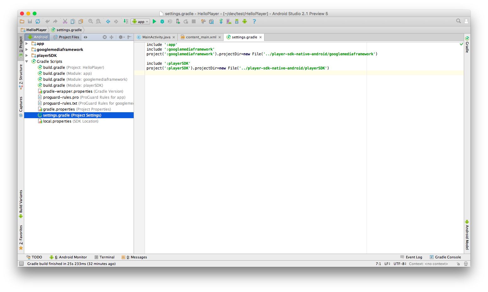
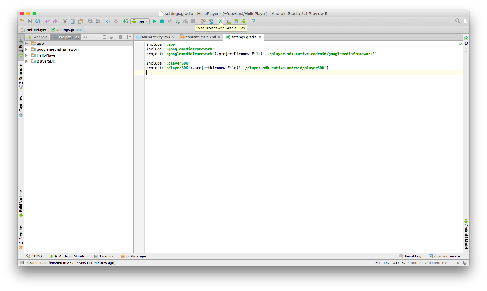

## Getting Started 

1. You will first need to clone the Android SDK and make sure that it resides in the same folder as your application:
	```
	git clone https://github.com/kaltura/player-sdk-native-android.git
	```
2. Edit the ```Setting.gradle``` file as follows:

```
include ':googlemediaframework'
project(':googlemediaframework').projectDir=new File('../player-sdk-native-android/googlemediaframework')

include ':playerSDK'
project(':playerSDK').projectDir=new File('../player-sdk-native-android/playerSDK')
```


3. Synchronize the project with the updated gradle:


4. Make sure that you cloned the ```player-sdk-native-android``` project to the same folder of your project; if you prefer to clone it in another location, remember to update the ```settings.gradle``` with the relevant path.

5. Right click your application folder and select ```Open Module Settings```.


6. Select the ```Dependencies``` tab, click the ```+``` button and then choose the playerSDK as ```module dependency```.


