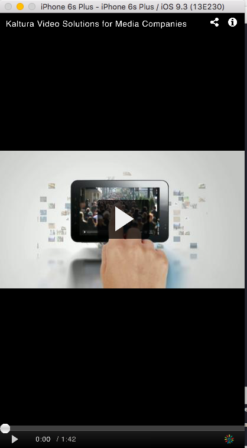

[](https://github.com/kaltura/player-sdk-native-ios) 

This article describes how to use the iOS Player SDK basic embedding.

## Importing the KPViewController into the Main Project  

To import the KPViewController, use the following command:

```
#import <KALTURAPlayerSDK/KPViewController.h>
```

## Creating a KPViewController Instance  

To create a KPViewController instance, use the following command:

```
@property (retain, nonatomic) KPViewController *player;
```

## Initializing the PlayerViewController for Fullscreen  

To initialize the a PlayerViewController for fullscreen, use the following command:

``` objc 
- (KPViewController *)player {
    if (!_player) {
        // Account Params
        KPPlayerConfig *config = [[KPPlayerConfig alloc] initWithServer:@"http://cdnapi.kaltura.com"
                                                         uiConfID:@"26698911"
                                                         partnerId:@"1831271"];
        
        
        // Video Entry
        config.entryId =  @"1_o426d3i4";
        
        // Setting this property will cache the html pages in the limit size
        config.cacheSize = 0.8;
        _player = [[KPViewController alloc] initWithConfiguration:config];
    }
    return _player;
}

- (void)viewDidAppear:(BOOL)animated {
    [super viewDidAppear:animated];
    [self presentViewController:self.player animated:YES completion:nil];
}
```



## Initializing the PlayerViewController for Inline  

To initialize the PlayerViewController for inline, see the steps in the [Inline Player](https://vpaas.kaltura.com/documentation/05_Mobile-Video-Player-SDKs/Fullscreen-inline-iOS.html) article.

