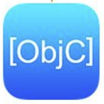
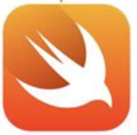

# Getting Started

This article will help you get started with the development of the Player SDK for iOS.

## Before You Begin  

Before you begin development with Kaltura iOS Player SDK, there are a few topics you should read up on first:

1. [**Media Providers**](): These are components that are capable of loading media data as PKMediaEntry representation.
2. [**CocoaPods**](https://guides.cocoapods.org/using/using-cocoapods.html) The kaltura iOS SDK and its plugins can be added to your project using the CocoaPods dependency manager. 

>Note: You'll need to use CocoaPods version 1.0 or newer.

## System Requirements  

* [iOS 9 and above](https://developer.apple.com/library/content/releasenotes/General/WhatsNewIniOS/Articles/iOS9.html#//apple_ref/doc/uid/TP40016198-SW1)
* Automatic Reference Counting (ARC) is required in your project.
* With the release of iOS 9 and Xcode 7, a new feature called App Transport Security (ATS) was introduced. [Learn more about Working with App Transport Security](https://developer.apple.com/library/content/documentation/General/Reference/InfoPlistKeyReference/Articles/CocoaKeys.html#//apple_ref/doc/uid/TP40009251-SW35).

## Quick Start

In this section, you will learn how to build a basic video playback app using the Kaltura Player SDK for iOS.

|            Objective-C            |                Swift               |
|:---------------------------------:|:----------------------------------:|
|  |  |
|        [basic video sample using the Obj-C]()       |        [basic video sample using the Swift]()        |
