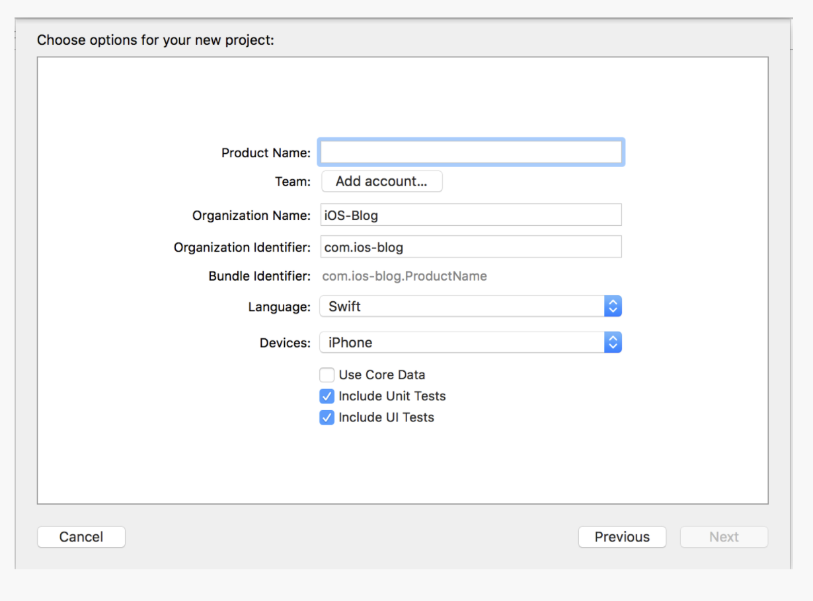

In this section, you'll learn how to build a simple video application using Kaltura SDK.

## Create the Project  

### Set Up a Project in Xcode  

1. Open Xcode and click **start new Xcode Project**:
	 

2. Next, select **Single View Application** and click **Next**:
	 

3. In the dialog screen displayed, enter the relevant details:
	 


### Add the SDK

The simplest way to add the SDK and its dependencies to your project is by using CocoaPods.

>Note: Using CocoaPods on an existing Xcode project will modify the project file, so you may want to make a backup before doing this.

1 . In your project folder, create a plain text file called `Podfile` (no file extension).

2 . Using a text editor, add the following lines of code to the Podfile and save it.

```ruby
source 'https://github.com/CocoaPods/Specs.git'

use_frameworks!

platform :ios, '9.0' # (define required version)

target 'BasicSample' do
    pod 'PlayKit'
end

pre_install do |installer|
    def installer.verify_no_static_framework_transitive_dependencies; end
end

post_install do |installer| 
    installer.pods_project.targets.each do |target| 
    	target.build_configurations.each do |config| 
            config.build_settings['SWIFT_VERSION'] = '3.0'
      	    config.build_settings['ALWAYS_EMBED_SWIFT_STANDARD_LIBRARIES'] = 'NO'
        end 
    end 
end
```
	
3 . Navigate to the podfile location via Terminal and type the command:

```ruby
    pod install
```

### Import the Native SDK

Go to the desired file (e.g., `ViewController.swift`) and add the line below:

>swift

```swift
import PlayKit
```

>objc

```objc
#import "PlayKit-Swift.h"
```

### Code the Video Player Application  

>Note: to change log level use `PlayKitManager` log level property.

```objc 
PlayKitManager.logLevel = PKLogLevelInfo;
```

```swift 
PlayKitManager.logLevel = .info 
```

You're now ready to code the video player application using the following options.

**Declare a Player Variable**

>swift

```swift
var player: Player?
```

>objc

```objc
@property (nonatomic, strong) id<Player> player;
```

**Set a Player Instance via a Sample Configuration**

>swift

```swift
let contentURL = "https://cdnapisec.kaltura.com/p/2215841/playManifest/entryId/1_w9zx2eti/format/applehttp/protocol/https/a.m3u8"

// create media source and initialize a media entry with that source
let entryId = "sintel"
let source = MediaSource(entryId, contentUrl: URL(string: contentURL), drmData: nil, mediaFormat: .hls)
// setup media entry
let mediaEntry = MediaEntry(entryId, sources: [source], duration: -1)

// create media config
let mediaConfig = MediaConfig(mediaEntry: mediaEntry)

do {
    self.player = try PlayKitManager.shared.loadPlayer(pluginConfig: nil)
    self.player!.prepare(mediaConfig)
    self.playerContainer.addSubview(self.player!.view)
} catch let e {
    // error loading the player
}
```

>objc

```objc
NSURL *contentURL = [[NSURL alloc] initWithString:@"https://cdnapisec.kaltura.com/p/2215841/playManifest/entryId/1_w9zx2eti/format/applehttp/protocol/https/a.m3u8"];

// create media source and initialize a media entry with that source
NSString *entryId = @"sintel";
MediaSource* source = [[MediaSource alloc] init:entryId contentUrl:contentURL mimeType:nil drmData:nil mediaFormat:MediaFormatHls];
NSArray<MediaSource*>* sources = [[NSArray alloc] initWithObjects:source, nil];
// setup media entry
MediaEntry *mediaEntry = [[MediaEntry alloc] init:entryId sources:sources duration:-1];

// create media config
MediaConfig *mediaConfig = [[MediaConfig alloc] initWithMediaEntry:mediaEntry startTime:0.0];

// load the player
NSError *error = nil;
self.player = [PlayKitManager.sharedInstance loadPlayerWithPluginConfig:nil error:&error];

if (!error) {
    [self.player prepare:mediaConfig];
    [self.playerContainer addSubview:self.player.view];
} else {
    // error loading the player
}
```

>Note: To learn more about player config creation, see the [PlayerConfig Doc](https://github.com/kaltura/DeveloperPortalDocs/blob/master/documentation/Mobile-Video-Player-SDKs/v3_iOS_PlayerConfig.md) article.

### Setting the Player View Size  

1 . Create a player container: 

>swift

```swift
@IBOutlet weak var playerContainer: UIView!
```

>objc

```objc
@property (weak, nonatomic) IBOutlet UIView *playerContainer;
```

2 . Set the player frame and add a player view as a subview:

>swift

```swift
self.player.view.frame = playerContainer.bounds
playerContainer.addSubview(self.player.view)
```

>objc

```objc
self.player.view.frame = CGRectMake(0, 0, self.playerContainer.frame.size.width,self.playerContainer.frame.size.height);   
[self.playerContainer addSubview:self.player.view];
```

**Note:** The way we recommand **setting player's view frame** is:

Using frame:

>swift

```swift
// make sure to add subview!
self.playerContainer.addSubview(self.player.view)

override func viewDidLayoutSubviews() {
    super.viewWillLayoutSubviews()
    self.player.view.frame = self.playerContainer.bounds
}
```

>objc

```objc
// make sure to add subview!
[self.playerContainer addSubview:self.player.view];

- (void)viewDidLayoutSubviews {
    [super viewWillLayoutSubviews];
    self.player.view.frame = self.playerContainer.bounds;
}
```

Using Autolayout Constraints:

>swift

```swift
// make sure to add subview!
self.playerContainer.addSubview(self.player.view)
// add the constraints
self.addConstraintsToPlayerView()

func addConstraintsToPlayerView() {
    let playerView = self.player.view
    playerView.translatesAutoresizingMaskIntoConstraints = false
    let views = ["playerView": playerView]
    
    let horizontalConstraint = NSLayoutConstraint.constraintsWithVisualFormat("H:|-0-[playerView]-0-|", options: [], metrics: nil, views: views)
    let verticalConstraint = NSLayoutConstraint.constraintsWithVisualFormat("V:|-0-[playerView]-0-|", options: [], metrics: nil, views: views)
    
    self.playerContainer.addConstraints(horizontalConstraint)
    self.playerContainer.addConstraints(verticalConstraint)
}
```

>objc

```objc
// make sure to add subview!
[self.playerContainer addSubview:self.player.view];
// add the constraints
[self addConstraintsToPlayerView];

- (void)addConstraintsToPlayerView {
    UIView *playerView = self.player.view;
    playerView.translatesAutoresizingMaskIntoConstraints = NO;
    NSDictionary *views = NSDictionaryOfVariableBindings(playerView);
    
    NSArray *horizontalConstraint = [NSLayoutConstraint constraintsWithVisualFormat:@"H:|-0-[playerView]-0-|" options:0 metrics:nil views:views];
    NSArray *verticalConstraint = [NSLayoutConstraint constraintsWithVisualFormat:@"V:|-0-[playerView]-0-|" options:0 metrics:nil views:views];
    
    [self.playerContainer addConstraints:horizontalConstraint];
    [self.playerContainer addConstraints:verticalConstraint];
}
```

### Adding Custom Buttons and Controls to the Player  

Add custom buttons and controls to the player as follows:

>swift

```swift
@IBAction func playTouched(_ sender: Any) {
    if self.player.isPlaying {
        self.player.play()
    }
}

@IBAction func pauseTouched(_ sender: Any) {
    if self.player.isPlaying {
        self.player.pause()
    }
}
```

>objc

```objc
- (IBAction)playTouched:(id)sender {
    if(!self.player.isPlaying) {
        [self.player play];
    }
}

- (IBAction)pauseTouched:(id)sender {
    if(self.player.isPlaying) {
        [self.player pause];
    }
}
```

> [Download Full Swift Sample](https://github.com/kaltura/playkit-ios-samples/tree/master/PlayKitApp/PlayKitApp)
> [Download Full Obj-C Sample](https://github.com/kaltura/playkit-ios-samples/tree/master/PlayKitApp/ObjCSample)

## Code Sample

[PlayKit iOS samples](https://github.com/kaltura/playkit-ios-samples) repo has a dedicated samples with more details.

## Have Questions or Need Help?  

Check out the [Kaltura Player SDK Forum](https://forum.kaltura.org/c/playkit) page for different ways of getting in touch.

