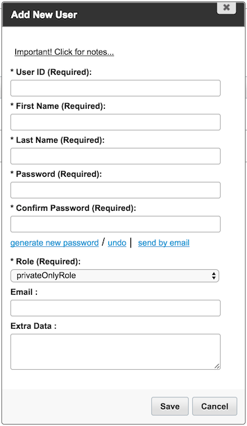
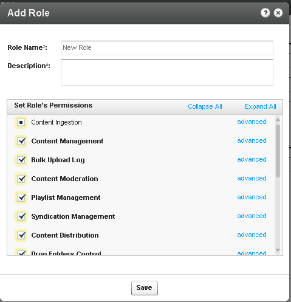
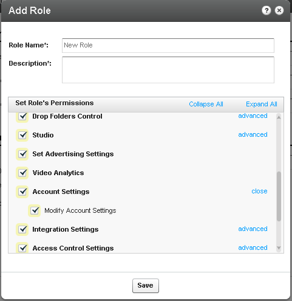

An Application Token enables clients to provide their development partners or internal technical teams with restricted access to the Kaltura API. Each Application Token restricts the API methods that may be called by its users, and can allow restricted content access for clients who use entitlements (e.g., restricted access to MediaSpace content).

Developers who are provided with an Application Token use it to create temporary Kaltura Session (KS) tokens, which they will then use to access API functions. These KS tokens will have the restrictions of their originating Application Token. The documentation for how to create a KS from an Application Token can be found in this [article](https://knowledge.kaltura.com/node/1280)

## Application Token Design  

The following three attributes are built into the Application Token:

### User with the Desired Content Permissions   

Accounts with entitlements may use a "service user" to restrict the content access permissions of the Appliation Token. You may create a new user, or use an existing user entity (such as a MediaSpace user). This user entity must be correctly permissioned with entitlements to the Channels or categories that you want to provide your development partners.

**Note:** Do not use a KMC user for this purpose, because a KMC user has unrestricted content access.

To create the user, open MediaSpace Admin, select the Manage Users tab, and click **Add User**. Fill in the details in the Add User window (the service user will never need to login, so use the Password Generator to create a difficult password for it). Once the user is created, give it permission to Channels and Galleries (or categories) using MediaSpace Channel Manager, or KMC Entitlements Manager. These permissions will be passedd to the Application Token.

### Role with the Required API Permissions  

The role determines the allowed API actions that this Application Token will be allowed to perform. Common role permissions are listed in the table under the **Relevant Roles** section below. Roles may be changed later to add or remove actions from the Application Token.

**Note:** This role dictates the use case, since it tells the API which role to call; therefore, verify that you've set up the role according to your current needs.

1. To set the role, in the Add User window, select **Add Role**. 
 
2. Enter the role name and description, then and select the relevant set of permissions in the Add Role window. You can select which functions are available to the role. 
3. Clicking the checkmark next to each permission group name will toggle the permission level for the specific function, according to the following modes:

 * Full Permission (checked) – Grants read-write access to the specified functionality. Includes the add/update/delete/list/get API actions for the relevant API service(s).
 * View-Only Permission (partially checked) – Read-only (get/list) functions will be allowed. Write actions will be blocked.
 * No Permission (cleared) – No access to the API service(s) assocaited with the listed functions.

 

When done, save your changes.

**Note:** You will need the ID of the newly-created role. Retrieve it using the userRole.list API action, or contact your Kaltura representative for assistance.

### Privileges Line

After creating the Role and Service User, you will construct the KS privileges of the Application Token.

For an Application Token *without* MediaSpace-based permissions (or other entitlement-based permissions), use a privileges line in the form: **list:\*,setrole:ROLE_ID**

For an Application Token with MediaSpace-based permissions (or other entitlement-based permissions), use a privileges line in the form: **list:\*,setrole:ROLE_ID,enableentitlement,privacycontext:PRIVACY_CONTEXT**. Your Privacy Context is listed in MediaSpace Admin, under the Application settings.

To learn more about KS privileges, check out [this](https://knowledge.kaltura.com/kalturas-api-authentication-and-security) article.

### Expiration Date

Every token will have a hardcoded expiration date. For short-lived projects, this date can be set only a few months or years into the future. It's also possible to create long-lived Application Tokens that will remain active decades into the future. Note that it's always possible to de-activate an Application Token.

The expiration date is set using a UNIX timestamp format (Epoch time).

### Session Expiration

The KS generated from an Application Token has a default expiration of 24 hours. It's possible to adjust this during the creation of the Application Token to create longer- or shorter-lived sessions.

### Hashing Function  

The default and recommended hashing function associated with an Application Token is SHA1. This type of hash function is available to all developers. Because Application Token hashes are salted, it does not pose a security risk. Clients with specific security requirements may select MD5, SHA-256, and SHA-512 functions.

## Application Token Creation

Create the new Application Token by invoking the **add** action of the **appToken** API service. You must have an Administrator-level KS to successfully invoke the service. Based on the information above, the following parameters for the call should be prepared:

* Permissions line (includes API restrictions via 'setrole' directive)
* Service user (required for restricting content access)
* Hashing function (default=SHA-1)
* Expiration 

Perform the call with the following parameters:

| Name        | Type | Writable | Description|
|:------------ |:------------------|:------------------|:------------------|
| sessionType  | int | V         |	The type of Kaltura Session (KS) that was created using the current token.This value should be set to 0 (USER-level KS) for most use cases. Use 2 (ADMIN-level KS) only for testing or advanced use cases. |
| sessionDuration  | int | V         |	Length of time for which the KS created from this Application Token will be valid. The default is 24-hours (86400 seconds). | 
| sessionPrivileges  | string | V         |	The privileges that will be imparted to KS generated with this Application token. |
| sessionUserId  | string | V         |	ID of the Service User that will provide entitlements for the KS created using this Application Token.  | 
| expiry  | int | V         |	The date and time when this Application Token will expire. This must be provided in a UNIX timestamp format (Epoch time). This field is mandatory and should be set when creating the application token. | 
| hashType  | string | V         |	One of the following:	MD5, SHA1 (default), SHA256, SHA512| 

A successful call will return a new Application Token. Note the following response values:

| Name        | Type  | Description|
|:------------ |:------------------|:------------------|
| id  | string | The ID of the new Application Token.  | 
| token  | string |	The Token value of the Application Token. | 
| status  | int | The Application Token status, which can be: Disabled =1, Active = 2, Deleted = 3 |
