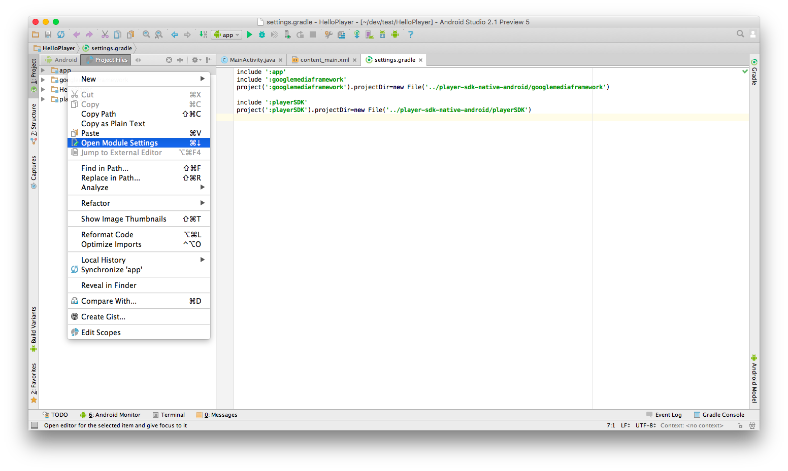

## Getting Started 

* clone Android SDK make sure it resides in same folder as your app
	```
	git clone https://github.com/kaltura/player-sdk-native-android.git
	```
2. Edit ```Setting.gradle``` file 

```
include ':googlemediaframework'
project(':googlemediaframework').projectDir=new File('../player-sdk-native-android/googlemediaframework')

include ':playerSDK'
project(':playerSDK').projectDir=new File('../player-sdk-native-android/playerSDK')
```


syncronize project with updated gradle 


* Make sure that you cloned the ```player-sdk-native-android``` project to the same folder of your project, if you prefer to clone it else where, you should update the ```settings.gradle``` with relevant path.

* Right click on your app folder -> ```Open Module Settings```



* Select ```Dependencies``` tab -> click on the ```+``` button and choose the playerSDK as ```module dependency```


