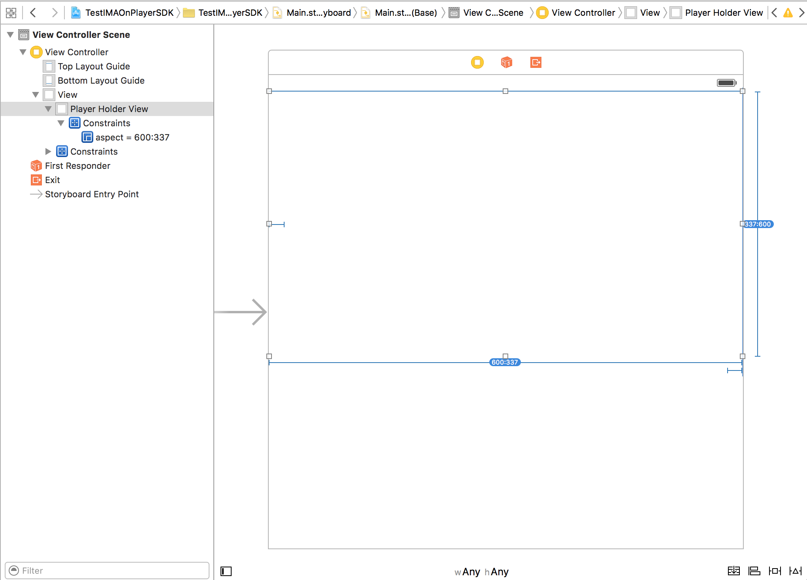

In this document we'll go over device rotation and fullscreen vs inline.

## Default Full Screen
The best practice for embeding the player in iOS is to use container view.

Prepare holder view for the player:



```
- (void)viewDidAppear:(BOOL)animated {
    [super viewDidAppear:animated];
    self.player.view.frame = (CGRect){CGPointZero, playerHolderView.frame.size};
    [self.player loadPlayerIntoViewController:self];
    [playerHolderView addSubview:_player.view];
}
```

The player will adjust its size according to the _**`playerHolderView`**_.
When the player will enter to full screen mode, the player's view will add as subview to the top window and when the player toggle back to normal mode the player's view will add to the _**`playerHolderView`**_ as subview.

#Custom Full Screen
If you want to handle the full screen behaviour by your self you have to set the _**`fullScreenToggeled`**_ **Block** :

```
[self.player loadPlayerIntoViewController:self];
    CGSize screen = self.view.frame.size;
    _playerRect = self.player.view.frame = (CGRect){0, 64, screen.width, (screen.width / 16) * 9};
    [self.view addSubview:_player.view];
    
    __weak ViewController *weakSelf = self;
        _player.fullScreenToggeled = ^(BOOL isFullScreen){
            if (isFullScreen) {
                weakSelf.player.view.frame = weakSelf.view.frame;
            } else {
                weakSelf.player.view.frame = weakSelf.playerRect;
            }
        };
```
  

